# Nigerian Banking Operations Analytics

A full end-to-end data analytics project analysing 20,000 Nigerian banking transactions from the NIBSS dataset. The project covers data cleaning, exploratory data analysis, SQL querying, and an interactive Power BI dashboard, built to demonstrate practical data analytics skills across Python, SQL, and Power BI.

---

## Project Overview

This project analyses real-world Nigerian banking transaction data to uncover patterns in transaction volume, channel performance, bank activity, and fraud behaviour. The dataset was sampled to 20,000 rows from the original NIBSS Nigerian Banking Transactions dataset on Kaggle.

The analysis answers key business questions:
- Which channels and banks drive the most transaction volume?
- What is the overall fraud rate and which techniques are most common?
- How do transaction volumes trend across the year?
- Which banks carry the highest fraud exposure?

---

## Tools and Technologies

- **Python** (Pandas, Matplotlib, Seaborn) for data cleaning and exploratory analysis
- **SQL** (SQLite) for structured querying and aggregation
- **Power BI** for interactive dashboard and visualisation
- **Jupyter Notebook** for documented analysis workflow
- **GitHub** for version control and portfolio presentation

---

## Dataset

- **Source:** NIBSS Nigerian Banking Transactions dataset via Kaggle
- **Sample size:** 20,000 rows
- **Raw file:** `data/raw/nibss_raw_sample.csv`
- **Cleaned file:** `data/cleaned/nibss_banking_cleaned.csv`
- **Data dictionary:** `data/raw/data_dictionary.csv`

Key columns: `transaction_id`, `customer_id`, `timestamp`, `amount`, `channel`, `bank`, `merchant_category`, `location`, `age_group`, `is_fraud`, `fraud_technique`

---

## Project Structure

banking-operations-analytics/
│
├── data/
│   ├── raw/
│   │   ├── nibss_raw_sample.csv
│   │   └── data_dictionary.csv
│   └── cleaned/
│       └── nibss_banking_cleaned.csv
│
├── python/
│   ├── 01_data_cleaning.ipynb
│   └── 02_eda_analysis.ipynb
│
├── sql/
│   ├── banking_analysis.sql
│   ├── query1_overall_summary.png
│   ├── query2_by_bank.png
│   ├── query3_fraud_technique.png
│   ├── query4_by_channel.png
│   ├── query5_top_customers.png
│   └── query6_monthly_trend.png
│
├── images/
│   ├── 01_transactions_by_channel.png
│   ├── 02_top_banks_by_volume.png
│   ├── 03_fraud_by_technique.png
│   └── 04_amount_distribution_by_channel.png
│
├── powerbi/
│   ├── banking_operations_dashboard.pbix
│   ├── dashboard_transaction_overview.png
│   ├── dashboard_bank_channel_performance.png
│   └── dashboard_fraud_analysis.png
│
└── README.md

---

## Verified KPIs

| Metric | Value |
|---|---|
| Total Transactions | 20,000 |
| Total Transaction Value | 3,129,748,077.69 NGN |
| Average Transaction Amount | 156,487.40 NGN |
| Total Fraud Cases | 57 |
| Fraud Rate | 0.29% |
| Top Channel | Mobile (8,905 transactions) |
| Top Bank | Access Bank (2,058 transactions) |
| Most Common Fraud Technique | Social Engineering (38 cases, 66.67%) |

---

## Python Analysis

### Notebook 1: Data Cleaning (`01_data_cleaning.ipynb`)

- Loaded the raw NIBSS dataset and sampled 20,000 rows
- Checked for missing values, duplicates, and incorrect data types
- Standardised column names and formats
- Exported the cleaned dataset to `data/cleaned/nibss_banking_cleaned.csv`

### Notebook 2: Exploratory Data Analysis (`02_eda_analysis.ipynb`)

- Analysed transaction distribution across channels, banks, and merchant categories
- Visualised fraud patterns by technique and bank
- Examined transaction amount distribution across channels
- Generated 4 charts saved to the `images` folder

**EDA Charts:**

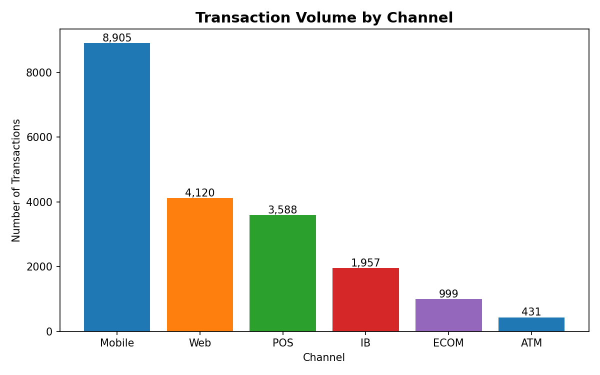

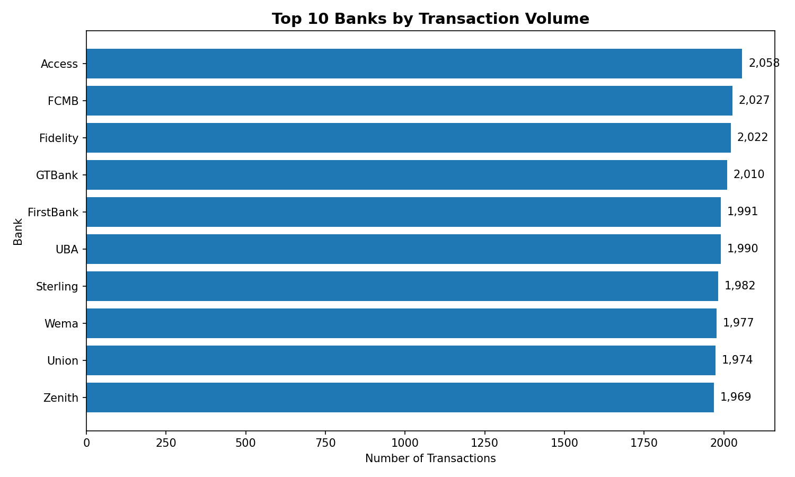

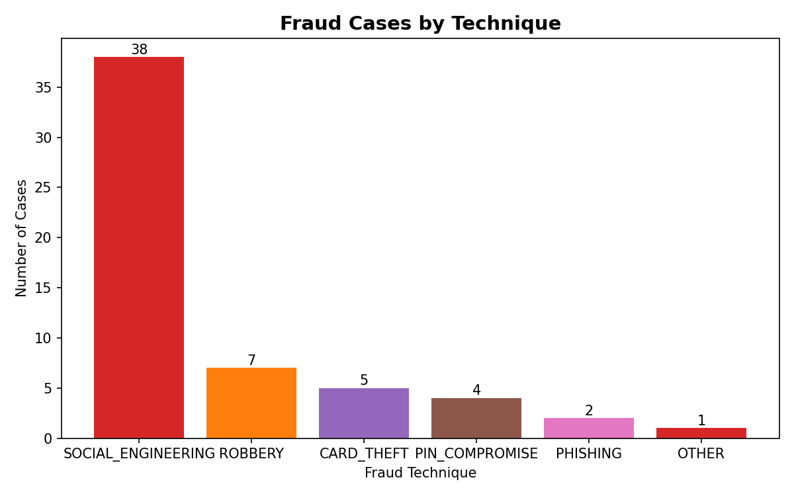

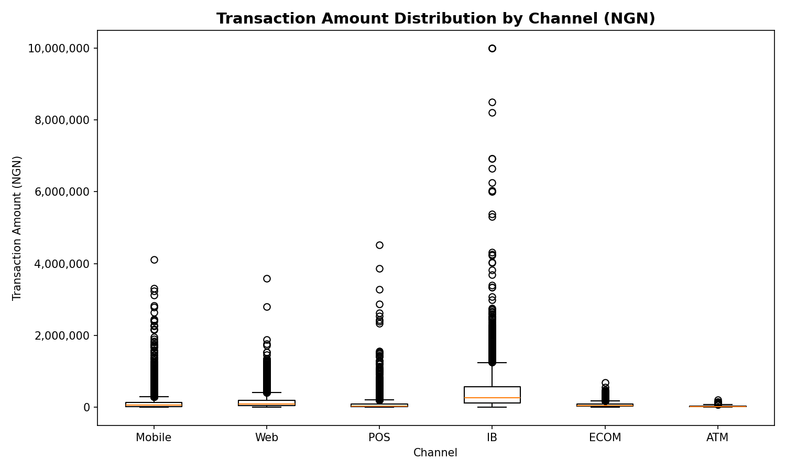

---

## SQL Analysis

All queries were written in SQLite and run against the cleaned dataset. Query result screenshots are in the `sql` folder.

### Query 1: Overall Summary
Returns total transactions, total value, average transaction amount, and fraud rate across the full dataset.

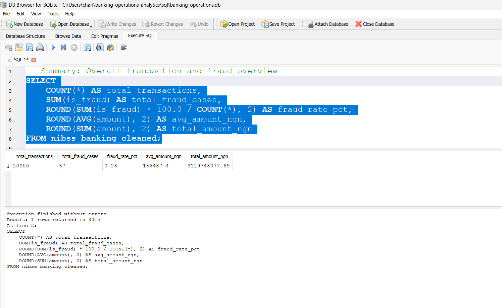

### Query 2: Transactions by Bank
Ranks all banks by transaction volume, fraud cases, total value and average transaction amount. Access Bank leads with 2,058 transactions and 9 fraud cases.

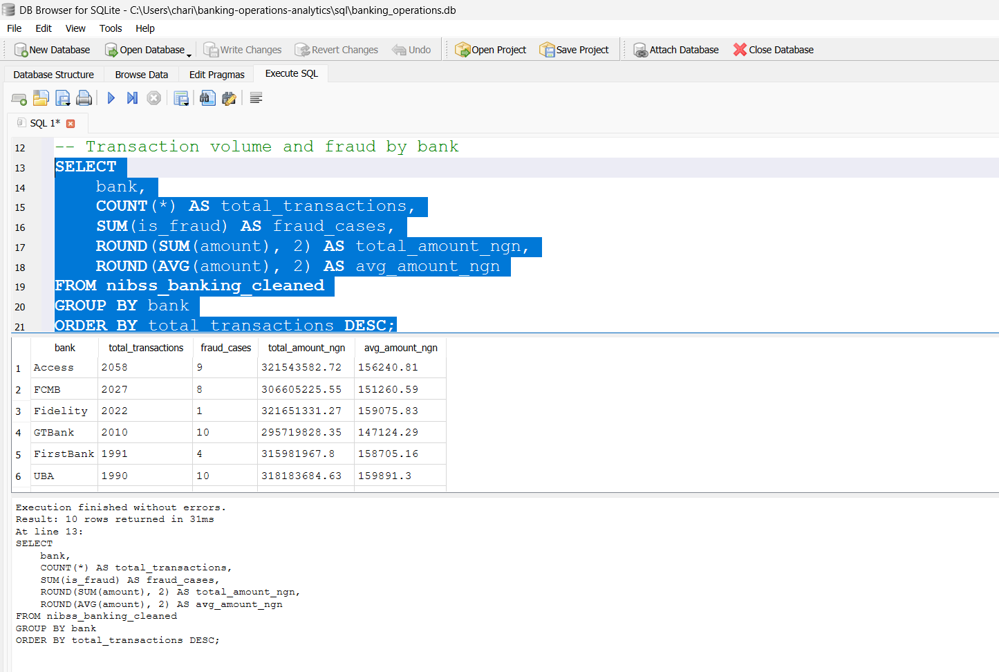

### Query 3: Fraud by Technique
Breaks down fraud cases by technique. Social Engineering accounts for 38 out of 57 cases at 66.67%.

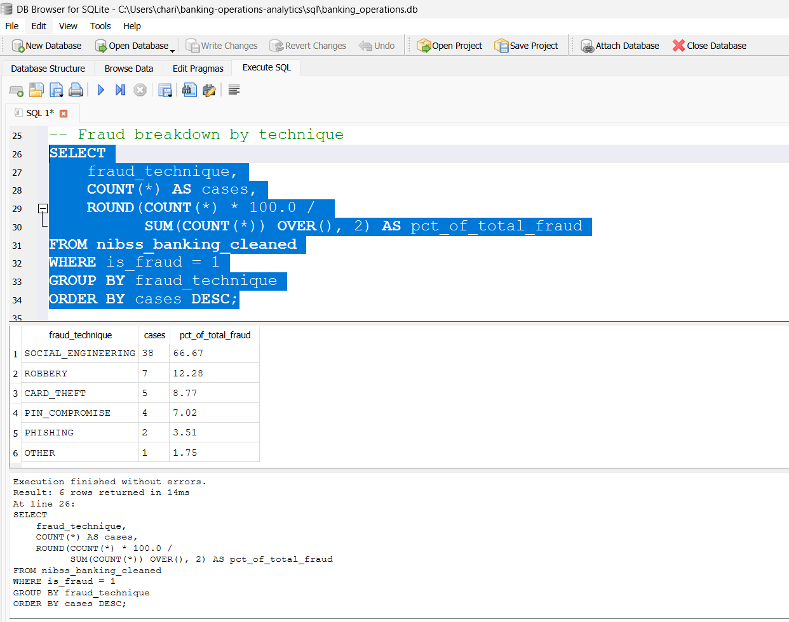

### Query 4: Transactions by Channel
Ranks channels by volume. Mobile is the top channel with 8,905 transactions.

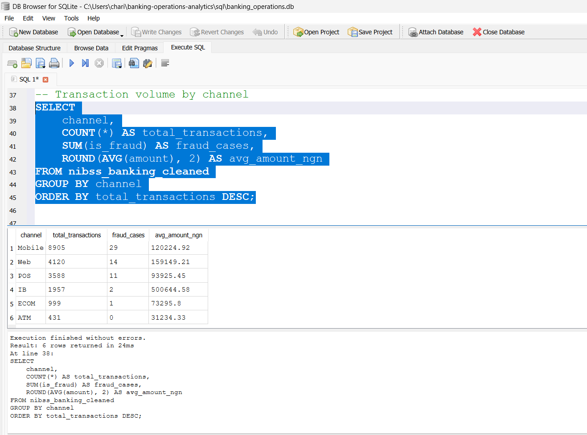

### Query 5: Top Customers
Identifies the highest value customers by total transaction amount.

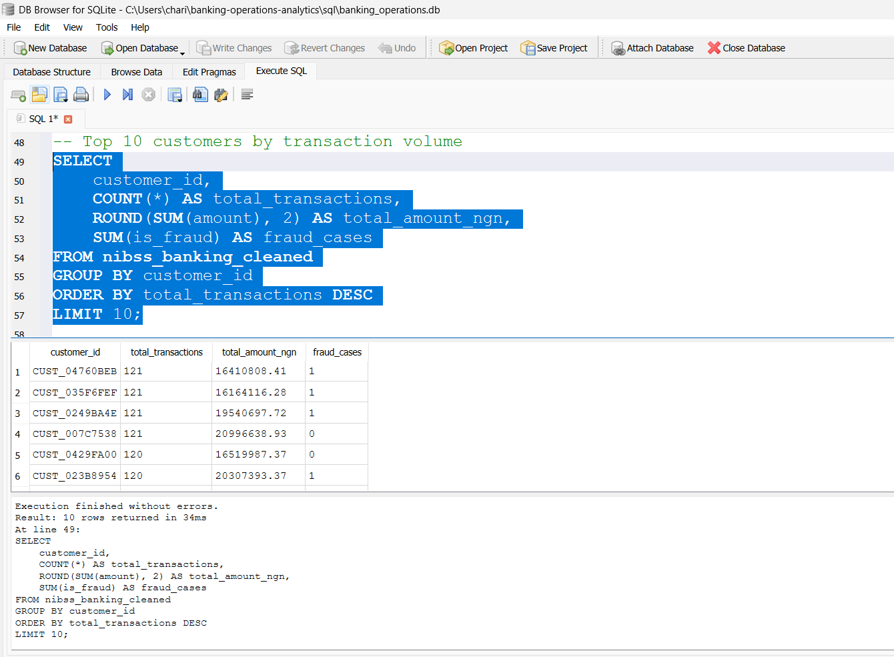

### Query 6: Monthly Trend
Shows how transaction volume changes across each month of the year.

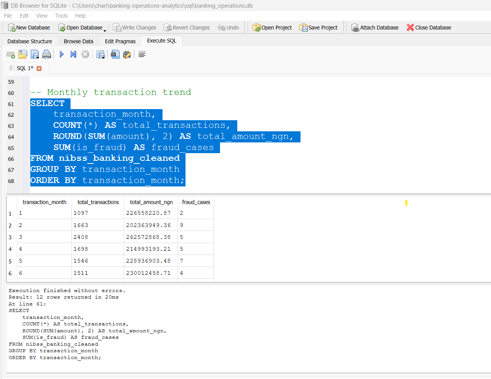

---

## Power BI Dashboard

The interactive dashboard has three pages built in Power BI Desktop.

### Page 1: Transaction Overview
Displays the 5 core KPI cards and breaks down transaction volume and value by channel.

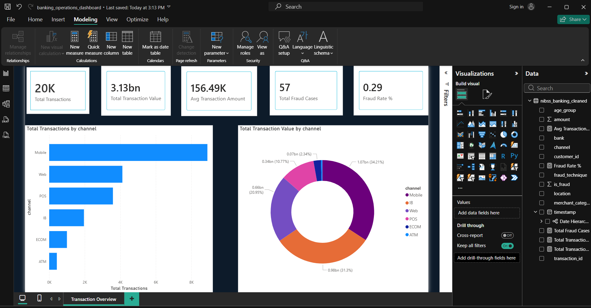

### Page 2: Bank and Channel Performance
Shows transaction volume by bank, monthly transaction trend, and a full bank summary table.

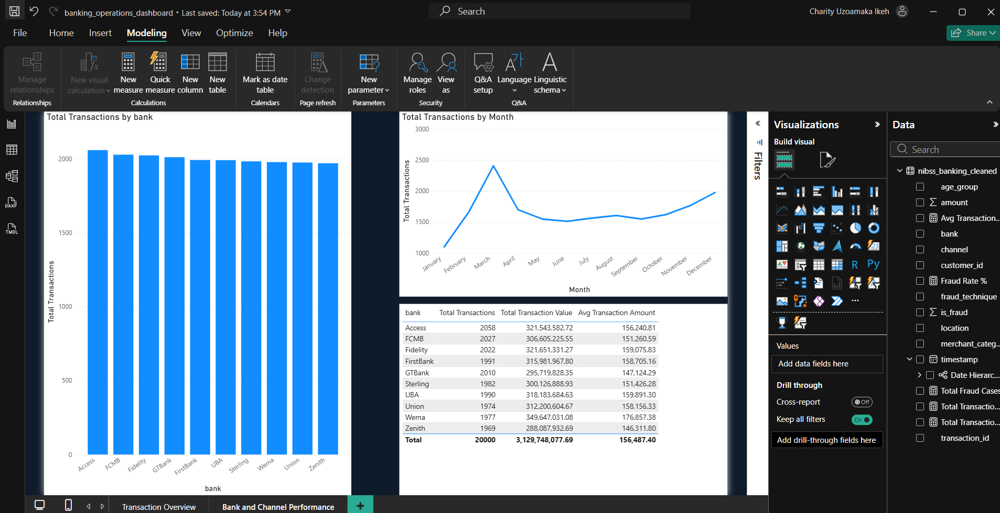

### Page 3: Fraud Analysis
Focuses on fraud patterns including cases by technique, technique breakdown, and fraud exposure by bank.

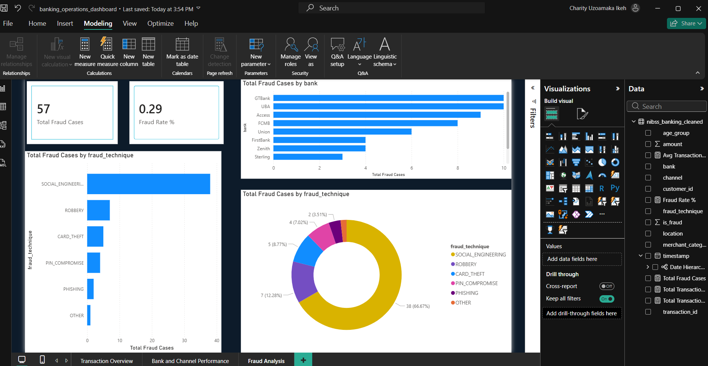

**DAX Measures used:**
- `Total Transactions = COUNTROWS(nibss_banking_cleaned)`
- `Total Transaction Value = SUM(nibss_banking_cleaned[amount])`
- `Avg Transaction Amount = AVERAGE(nibss_banking_cleaned[amount])`
- `Total Fraud Cases = CALCULATE(COUNTROWS(nibss_banking_cleaned), nibss_banking_cleaned[is_fraud] = 1)`
- `Fraud Rate % = DIVIDE([Total Fraud Cases], [Total Transactions]) * 100`

---

## Key Findings

- Mobile banking dominates transaction volume, accounting for the largest share of both transaction count and total value
- All 10 banks show relatively even transaction volumes with Access Bank leading at 2,058 transactions
- Fraud is low at 0.29% but Social Engineering is the dominant technique at 66.67% of all fraud cases
- Transaction volume peaked in March and dipped mid-year before recovering toward December
- GTBank and UBA carry the highest fraud case counts by bank

---

## Author

**Charity Ikeh**
Data Analyst
[GitHub](https://github.com/Charity-Ikeh) | [LinkedIn](https://www.linkedin.com/in/charity-ikeh)
